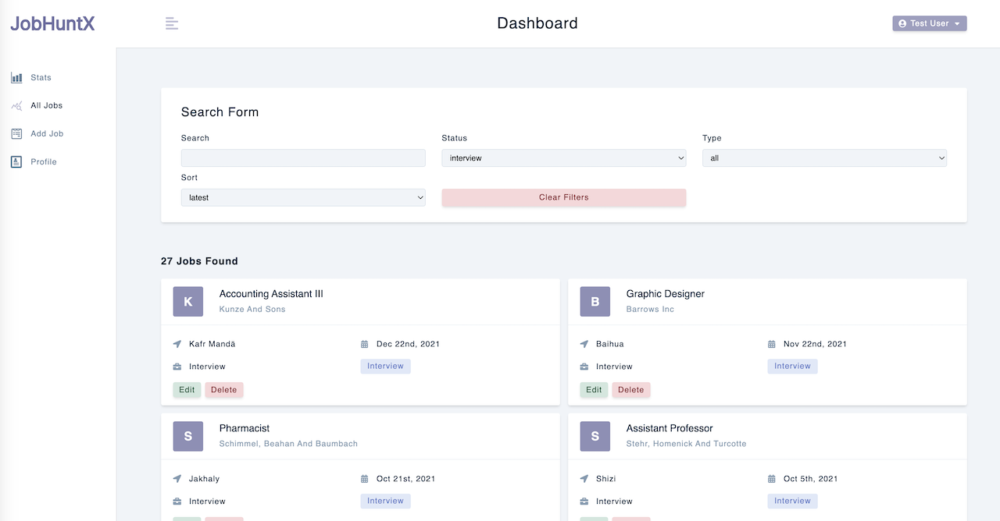

## JobHuntX

`JobHuntX` is a web application built with `React`, designed to provide users with a seamless platform to manage job listings. The application offers features to add, edit, and search for jobs efficiently. Leveraging the power of `Redux Toolkit`, users can perform searches and effortlessly apply filters to jobs based on their status and type. The built-in sorting functionality further enhances the user experience. Clearing filters is also intuitive and user-friendly, ensuring a smooth interaction process.

The application's navigation and routing system are powered by the latest version of `React Router 6`, enabling users to navigate through different sections of the app seamlessly.

Through the integration of the `Recharts` library, JobHuntX takes data visualization to the next level. Interactive and visually appealing charts and graphs allow users to gain insights into job data trends and distributions.

### Tech Stack
- `JavaScript`
- `React`: The powerful JavaScript library used to build the project.
- `React Router 6`: For seamless navigation and routing within the application.
- `Redux Toolkit`: The core library for state management, offering features like `Immer` for state mutation, `Redux Thunk` for handling asynchronous actions, and `Reselect` for simplifying reducer functions.
- `Axios`: For efficient handling of API requests and data management.
- `Styled Components`: For creating stylish and responsive designs.
- `React Icons`: For incorporating iconic visuals throughout the app.
- `react-toastify`: The library that provides `toast notifications` for alerts during list interactions.
- `Moment.js`: A widely used library for parsing, manipulating, and formatting dates and times in JavaScript.
- `Recharts`: A popular charting library for React that provides a simple and customizable way to create interactive and visually appealing charts.

### Explore The Website
[JobHuntX on Netlify](https://jobhuntx.netlify.app/)

### Preview

